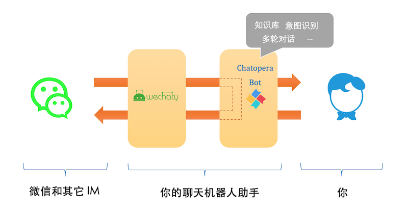

# WECHATY-CHATOPERA

## INTRODUCTION

Bring your bots into Wechat with Wechaty Chatopera Plugin.



## REQUIREMENTS

1. Node.js v12+
1. Wechaty v0.40+
1. This Chatopera Plugin

## USAGE

To use the plugin:

```ts
import { WechatyChatopera } from "wechaty-chatopera";

const config = {
  /**
   * Chatopera Service ID
   */
  clientId: "5fbcb0afcad362001b4e3b12",
  secret: "c03e26976ac9aed372953b48f55d09f9",
};

const ChatoperaPlugin = WechatyChatopera(config);

const wechaty = new Wechaty();
wechaty.use(ChatoperaPlugin);
```

### 1 Configure Chatopera

[Chatopera 云服务](https://bot.chatopera.com)是一站式实现聊天机器人的云服务，按接口调用次数计费。Chatopera 云服务是 [Chatopera 机器人平台](https://docs.chatopera.com/products/chatbot-platform/index.html)的软件即服务实例。在云计算基础上，Chatopera 云服务属于**聊天机器人即服务**的云服务。

Chatopera 机器人平台包括知识库、多轮对话、意图识别和语音识别等组件，标准化聊天机器人开发，支持企业 OA 智能问答、HR 智能问答、智能客服和网络营销等场景。企业 IT 部门、业务部门借助 Chatopera 云服务快速让聊天机器人上线！

<details>
<summary>展开查看 Chatopera 云服务的产品截图</summary>
<p>

<p align="center">
  <b>自定义词典</b><br>
  
</p>

<p align="center">
  <b>自定义词条</b><br>
  
</p>

<p align="center">
  <b>创建意图</b><br>
  
</p>

<p align="center">
  <b>添加说法和槽位</b><br>
  
</p>

<p align="center">
  <b>训练模型</b><br>
  
</p>

<p align="center">
  <b>测试对话</b><br>
  
</p>

<p align="center">
  <b>机器人画像</b><br>
  
</p>

<p align="center">
  <b>系统集成</b><br>
  
</p>

<p align="center">
  <b>聊天历史</b><br>
  
</p>

</p>
</details>

<p align="center">
  <b>立即使用</b><br>
  <a href="https://bot.chatopera.com" target="_blank">
      
  </a>
</p>

### 2 Language of Questions & Score of Answers

### 3 Matchers & Skipper

## ENVIRONMENT VARIABLES

## HISTORY

### develop

### v0.1 (Nov 24, 2020)

1. Add Basic Plugin for Chatopera
2. Enabel Wechaty with Chatopera

## AUTHOR

[吴京京](https://github.com/wj-Mcat), Author of Python-wechaty & NLP Researcher, \<wjmcater@gmail.com\>

## COPYRIGHT & LICENSE

- Code & Docs © 2020 wj-Mcat \<wjmcater@gmail.com\>
- Code released under the Apache-2.0 License
- Docs released under Creative Commons
